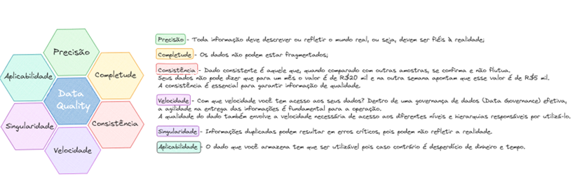
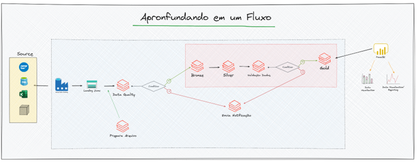

# Projeto BI com Azure e seus componentes

### 10 - Data Quality

A garantia da qualidade de dados é fundamental para a tomada de decisões, análises precisas e confiáveis, conformidade regulatória e a eficácia das operações comerciais. 

As práticas de Data Quality envolvem a identificação, avaliação e correção de problemas de qualidade de dados para garantir que os dados sejam confiáveis, precisos e úteis para os usuários finais.

Diante das explicações acima, Data Quality, ou Qualidade de Dados, refere-se à medida em que um conjunto de dados atende aos requisitos e expectativas estabelecidos para sua utilização. Em outras palavras, é a capacidade de um conjunto de dados ser preciso, consistente, completo, relevante e atualizado para atender às necessidades de negócios e análises.

Em nosso Workshop estaremos abordando como que funciona na prática a sua aplicação.

| Recurso | Recurso | Nome do Recurso | Descrição |
| ------ |  ------ |  ------ |  ------ |
|  | Framework Data Quality | Framework | Uma solução de data quality, ou qualidade de dados, refere-se a um conjunto de práticas, processos e ferramentas utilizadas para garantir que os dados em um sistema ou organização estejam completos, precisos, consistentes, atualizados e relevantes para o propósito pretendido. |
