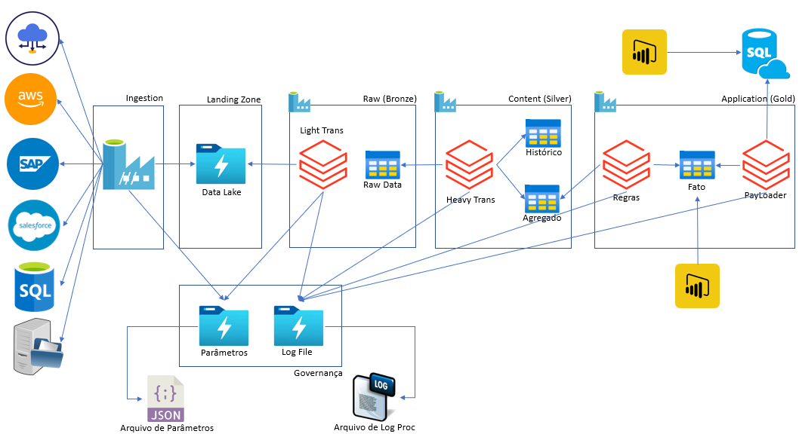

# Workshop BI com Azure e seus componentes

### 11 - Monitoramento

### SEQ-11.1 - Monitoramento

Nessa etapa irei apresentar para você como que conseguimos monitorar a execução de uma pipeline no Azure Data Factoty além de criarmos nosso próprio monitoramento. 

Podendo gerar relatórios de melhorias, focar atenção para os processos que estão apresentando maior incidÊncia de falhas e até naqueles processos com alto tempo de processamento.

### SEQ-11.2 - Parametrização

Quando trabalhamos com pipelines parametrizadas, passamos a ter um processo versátil que além de outras caracteristicas importantes, podemos destacar a reutilização de código, uma vez que o processo foi desenvolvido e é orientado a parâmetros.

