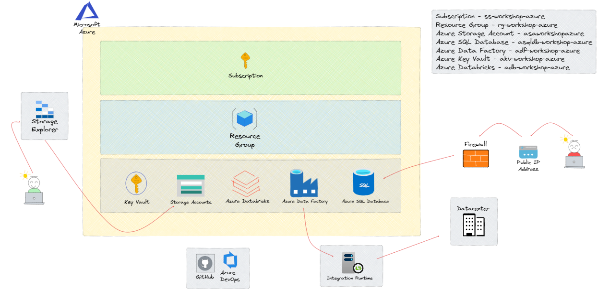

# Workshop BI com Azure e seus componentes

Essa etapa é responsável por explicar os recursos que serão usados durante o treinamento.

### 2.1 - Recursos que serão usados da Cloud Azure

Pré-Requisito para o andamento do projeto.

| Recurso | Recurso Azure | Nome Recurso Projeto | Descrição |
| ------ |  ------ |  ------ |  ------ |
|  | Subscription | ss-workshop-azure | Uma "subscription" (assinatura) da Microsoft Azure é um contrato com a Microsoft que permite aos usuários acessar e usar os serviços e recursos da plataforma Azure. |
|  | Azure Resource Group | rg-workshop-azure | Um Azure Resource Group (Grupo de Recursos do Azure) é um contêiner lógico que agrupa recursos relacionados em uma assinatura da Microsoft Azure. Ele é usado para gerenciar e organizar recursos de maneira lógica e coesa.  |
|  | Azure Storage Account | asaworkshopazure | Uma conta de armazenamento do Azure (Azure Storage Account) é um serviço central da plataforma de nuvem da Microsoft, Azure, que fornece armazenamento altamente disponível, seguro, durável, escalável e acessível na nuvem. |
|  | Azure Data Factory | adf-workshop-azure | O Azure Data Factory é um serviço de integração de dados totalmente gerenciado pela Microsoft Azure que permite criar, agendar e orquestrar fluxos de trabalho de movimentação e transformação de dados em larga escala.  |
|  | Azure SQL Database | asqldb-workshop-azure | O Azure SQL Database é um serviço de banco de dados relacional totalmente gerenciado oferecido pela Microsoft Azure. Ele é baseado na popular plataforma de banco de dados SQL Server da Microsoft e fornece uma solução de banco de dados na nuvem altamente escalável, segura e de alto desempenho. |
|  | Azure Key Vault | akv-workshop-azure | O Azure Key Vault é um serviço de gerenciamento de segredos e chaves na Microsoft Azure, projetado para proteger, armazenar e controlar o acesso a chaves de criptografia, senhas, certificados e outros segredos confidenciais usados por aplicativos e serviços na nuvem. |
|  | Azure Databricks | adb-workshop-azure | O Azure Databricks é um serviço de análise unificada baseado na nuvem que combina o poder do Apache Spark com uma plataforma de colaboração e integração. Desenvolvido em parceria com a Databricks e a Microsoft, o Azure Databricks permite que equipes de análise e engenharia de dados colaborem em projetos de big data e análise de dados de forma eficiente e escalável. |

### 2.2 - Recursos Extras

| Recurso | Recurso | Nome do Recurso | Descrição |
| ------ |  ------ |  ------ |  ------ |
|  | Framework Data Quality | Framework | Uma solução de data quality, ou qualidade de dados, refere-se a um conjunto de práticas, processos e ferramentas utilizadas para garantir que os dados em um sistema ou organização estejam completos, precisos, consistentes, atualizados e relevantes para o propósito pretendido. |
|  | GitHub | prj_azure_git | GitHub é uma plataforma de desenvolvimento de software baseada na web que oferece controle de versão Git e ferramentas de colaboração para desenvolvedores. |
|  | Azure DevOps | prj_azure_devops | Azure DevOps é um conjunto de serviços de colaboração baseados na nuvem que permitem planejar, desenvolver, testar e implantar aplicativos de software com eficiência. Ele fornece uma plataforma integrada para gerenciamento de projetos de software e ciclo de vida de desenvolvimento, permitindo que equipes de desenvolvimento entreguem software de alta qualidade de maneira rápida e contínua. |
|  | Azure Data Studio | Azure Data Studio | O Azure Data Studio é uma ferramenta de gerenciamento de dados multiplataforma, gratuita e de código aberto, desenvolvida pela Microsoft. Ela oferece uma experiência unificada para desenvolvedores e administradores de banco de dados trabalharem com uma variedade de sistemas de gerenciamento de banco de dados, incluindo SQL Server, Azure SQL Database, PostgreSQL e MySQL. |
|  | Azure Storage Explorer | Azure Storage Explorer | O Azure Storage Explorer é uma ferramenta gratuita e independente desenvolvida pela Microsoft que permite aos usuários gerenciar recursos de armazenamento do Azure de forma eficiente e intuitiva. Ele oferece uma interface gráfica fácil de usar para acessar e interagir com contas de armazenamento, blobs, tabelas, filas e arquivos no Azure. |