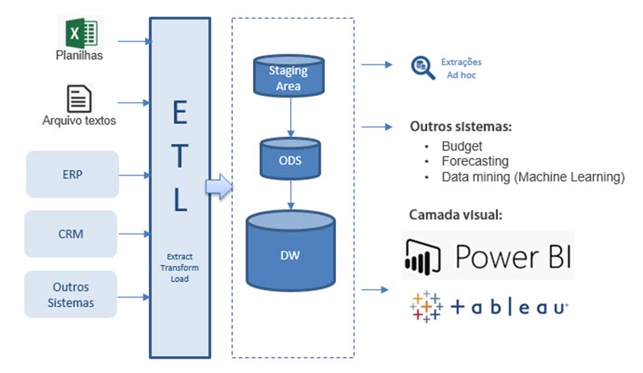
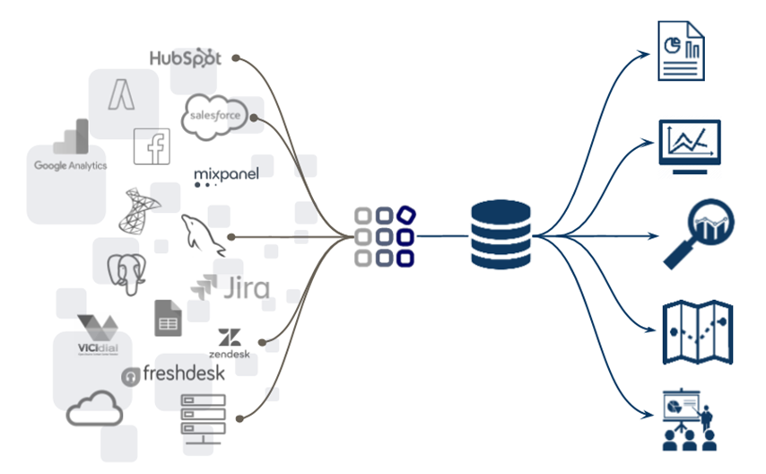

# Projeto BI com Azure e seus componentes

## 4 - Falando um pouco sobre ETL e ELT

Outro ponto que merece sua atenção é o assunto relacionado a ETL e ETL.

Ainda existem muitas dificuldades de compreender o seu funcionamento, quando devo usar, quais são as principais diferenças entre eles e até outras...

No nosso Workshop, existirá um tópico específico e exclusivo para falarmos sobre esse assunto e eu garanto que você irá sair sabendo responder as perguntas abaixo.

|Sequência|Dúvida|Resposta
|---|---|---|
| 1 | O que é um ETL e um ELT? | ? |
| 2 | Quando devo aplica-los? | ? |
| 3 | Quais etapas compõem cada fase do processo? | ? |
| 4 | Posso ter um projeto de BI sem esse tal de ETL ou ELT? | ? |
| 5 | Quais são as diferenças entre ETL e ELT? | ? |
| 6 | É caro construir e manter um processo de ETL ou ELT? | ? |
| 7 | Quais são os componentes mais comuns do fluxo de ETL e ELT? | ? |

### 4.1 - Representação Gráfica do Fluxo de ETL

### 4.2 - Representação Gráfica do Fluxo de ELT

