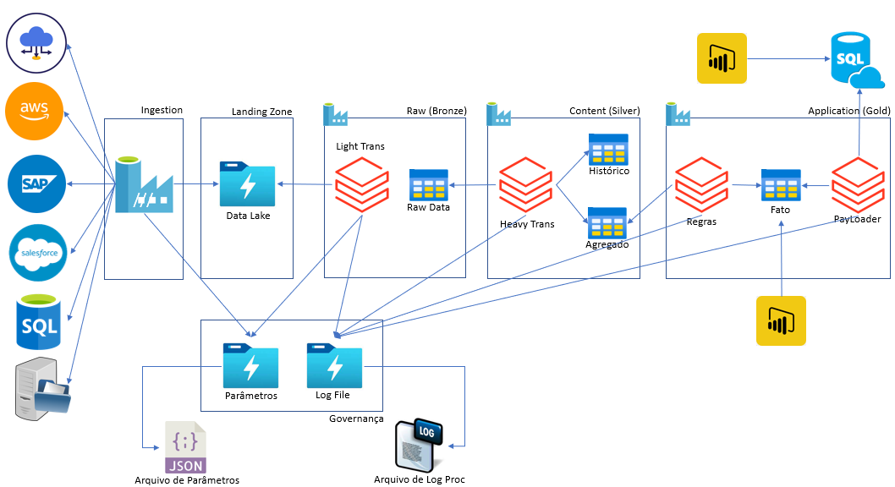

# Projeto BI com Azure e seus componentes

## 5 - Arquitetura

E quando entrarmos no assunto arquitetura de dados, o que podemos esperar?

Muita coisa, isso eu já posso adiantar pra você!

Vou tentar destacar alguns pontos, ok?

|Sequência|Dúvida|Resposta
|---|---|---|
| 1 | Quais são as suas fases? | ? |
| 2 | Quando estarei pronto para construir? | ? |
| 3 | O que ela representar dentro de um projeto de BI e Big Data? | ? |
| 4 | Existe diferenças entre o mundo OnPremises e Cloud? | ? |
| 5 | Quais componentes fazem parte de uma Arquitetura de Dados? | ? |

Eis um pequeno aperitivo...

### 5.1 - Representação Gráfica de uma Arquitetura BI ou Arquitetura On-Premise

### 5.2 - Representação Gráfica de uma Arquitetura Big Data ou Modern Data Architecture

