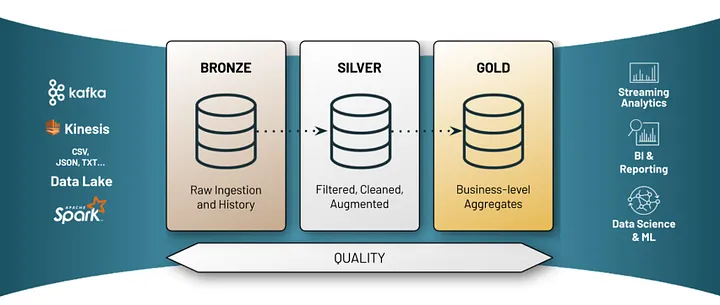
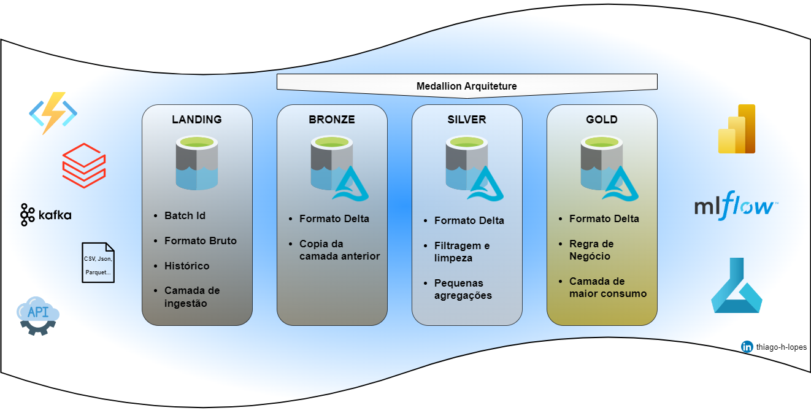

# Projeto BI com Azure e seus componentes

## 6 - Arquitetura Medalhão

Caso tivesse que definir a arquitetura medalhão em poucas palavras eu poderia colocar o seguinte:

"A arquitetura medalhão é um padrão arquitetural comumente utilizado em sistemas de processamento de dados distribuídos.

Onde Sistemas de processamento de dados distribuídos se referem a sistemas de computação que processam grandes volumes de dados divididos em múltiplos componentes ou nós de processamento, que podem estar localizados em diferentes máquinas físicas ou em uma infraestrutura de nuvem distribuída."

 

|Sequência|Pergunta|Resposta
|---|---|---|
| 1 | O que é a arquitetura medalhão? | ? |
| 2 | Qual a vantagem da sua implantação? | ? |
| 3 | Quando/Por que preciso criar a Landing Zone? | ? |

Representação Gráfica de uma Arquitetura Medalhão

Arquitetura que iremos implementar.

