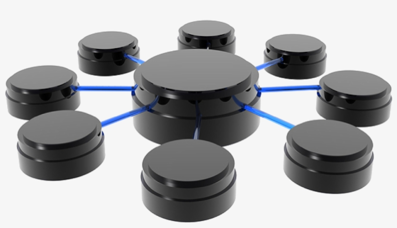
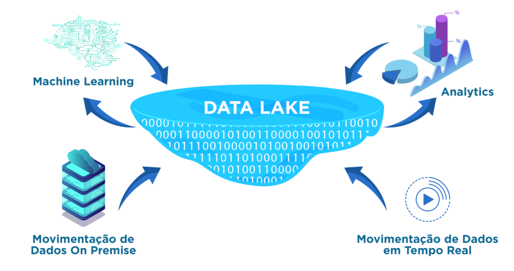
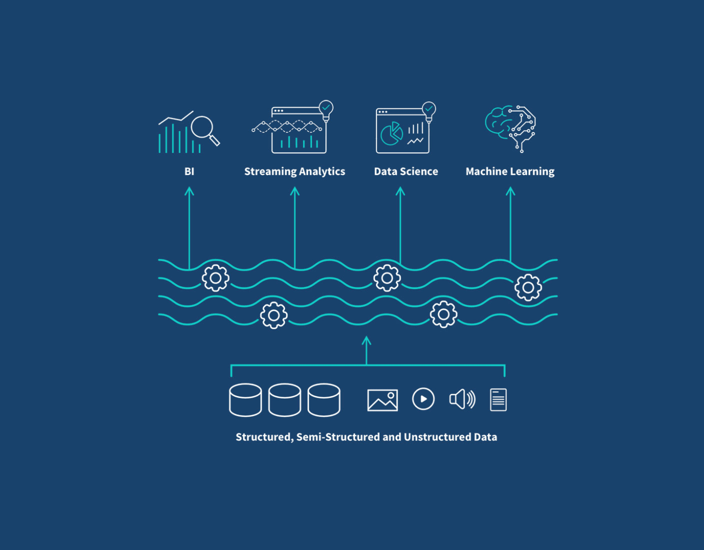
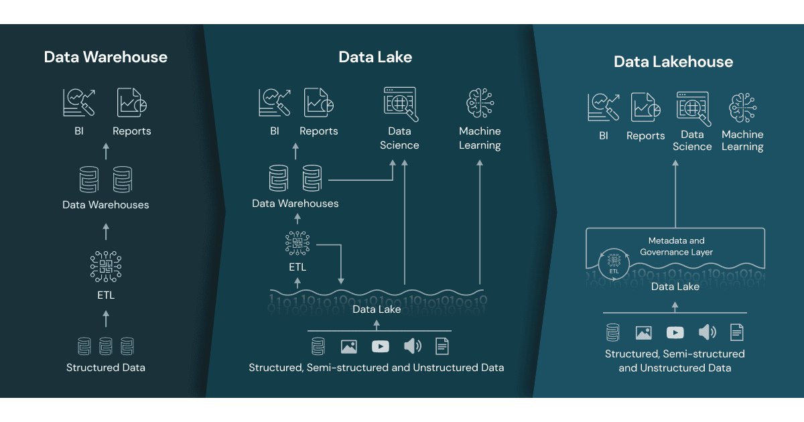

# Workshop BI com Azure e seus componentes

### 7 - O que conseguiremos compreender depois desse capítulo?

Entramos nesse momento em uma das parte mais importantes do nosso Workshop.

Vamos falar um pouco sobre Data Warehouse, Data Lake, Delta Tables e Data Lakehouse.

Vamos entender de forma macro alguns conceitos:

* Um Data Warehouse é um sistema de armazenamento centralizado e otimizado para análise de dados históricos e operacionais. 

* Um Data Lake é um repositório de dados que armazena grandes volumes de dados brutos e não processados, em sua maioria em formato não estruturado ou semi-estruturado. 

* Uma Delta Table é uma tabela de dados distribuída que utiliza o formato Delta Lake, um formato de armazenamento de dados otimizado para análises de big data em ambientes de nuvem. Ela combina as características de um Data Lake com os benefícios de um Data Warehouse, oferecendo a capacidade de armazenar dados brutos e processados em um único local.

* Um Data Lakehouse é uma arquitetura de dados que combina os conceitos de Data Lake e Data Warehouse em um único ambiente. Ele integra as capacidades de armazenamento flexível e escalável do Data Lake com a capacidade de consulta e análise estruturada do Data Warehouse. O Data Lakehouse é projetado para oferecer flexibilidade, escalabilidade e desempenho para análises de big data, permitindo que as organizações processem e analisem grandes volumes de dados de forma eficiente e confiável.

 

|Sequência|Dúvida|Resposta
|---|---|---|
| 1 | O que é um Data Warehouse? | ? |
| 2 | O que é um Data Mart? | ? |
| 3 | O que é um Data Lake? | ? |
| 4 | Por que preciso ter um Data Lake e não um Data Warehouse? | ? |
| 5 | Data Lake é a mesma coisa que Data Warehouse? | ? |
| 6 | Quais são as diferenças entre um Data Warehouse e um Data Lake? | ? |
| 7 | O que é o Data LakeHouse? | ? |
| 8 | O que é o Delta Lake? | ? |

Vamos a alguns exemplos...

Representação Gráfica de um Data Warehouse

Representação Gráfica de um Data Lake

Representação Gráfica de um Data Lakehouse

Evolução do Data Warehouse para o Data Lakehouse

