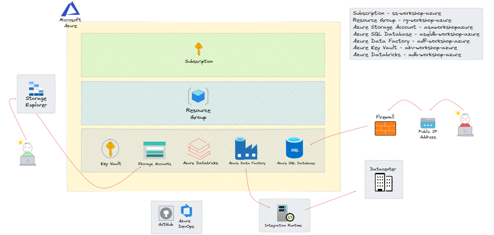

# Workshop BI com Azure e seus componentes

### 8 - Segurança em uma Pipeline de Dados

Como podemos garantir as melhores práticas de segurança em nossa arquitetura de dados?

Dentro do ecosistema da Azure, existe um recurso chamado Azure Key Vault. 

Esse recurso ele funciona como um confre de senhas e credenciais de acesso. 

Durante o nosso Workshop, estarei apresentando de forma bem detalhada como estaremos fazendo a sua utilização para gerenciar nossas credenciais e com isso garantir que o acesso aos nossos recursos sejam realizados de forma gerenciada.

 

 

| Recurso | Recurso Azure | Nome Recurso Projeto | Descrição |
| ------ |  ------ |  ------ |  ------ |
|  | Azure Key Vault | akv-workshop-azure | O Azure Key Vault é um serviço de gerenciamento de segredos e chaves na Microsoft Azure, projetado para proteger, armazenar e controlar o acesso a chaves de criptografia, senhas, certificados e outros segredos confidenciais usados por aplicativos e serviços na nuvem. |
