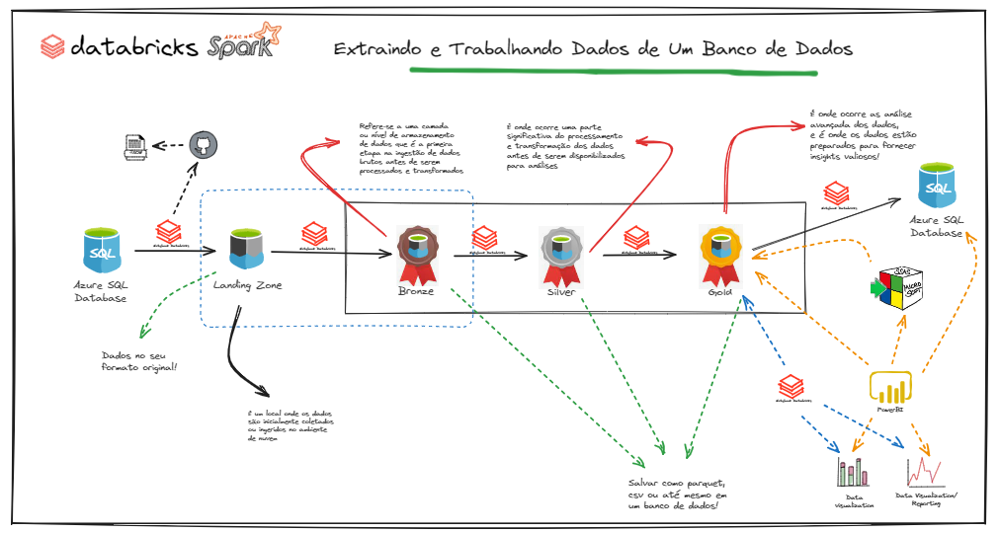

# Projeto BI com Azure e seus componentes

## Apresentação do Projeto

Nesse projeto vamos abordar o fluxo dos dados de no Azure de Ponta a Ponta..

Partindo da premissa que o projeto deverá conter as seguintes fases:

* 1 - Os dados estão disponíveis em um banco de dados Azure SQL Database;
* 2 - Esses dados deverão ser extraídos e persistidos na camada Landing Zone para posterior processamento;
* 3 - Após a extração, os dados são processados e armazenados na camada bronze sem nenhum tratamento de dados. A estrutura das tabelas da camada bronze deverão ser identicas a dos arquivos;
* 4 - Na camada silver, os dados deverão passar por transformações/tratamentos que são descritos mais a frente;
* 5 - Na camada gold, os dados devem estar modelados no padrão multidimensional, criando tabelas de dimensões e fato;

Como vamos fazer isso tudo acontecer?