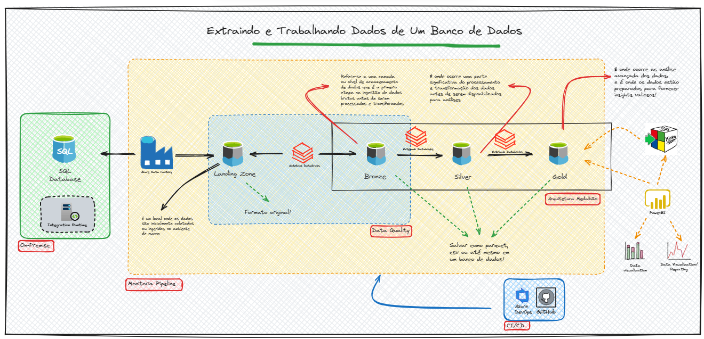

# Workshop BI com Azure e seus componentes

## Apresentação do Workshop

Este Workshop tem como objetivo explorar todas as etapas do fluxo de dados de uma empresa, desde a sua origem até o destino final, utilizando uma esteira de dados no Azure de maneira abrangente e integrada.

Vou explicar o contexto do projeto que será desenvolvido durante o Workshop. 

Primeiro ponto:

* 01 - Os dados da minha empresa estão disponíveis em um banco de dados OnPremise;

Segundo ponto:

* 02 - Esses dados deverão ser extraídos do sistema de forma diária e armazenados em algum lugar;

* 03 - Os dados são divididos em duas categorias: Dados mestres (dados de cliente, loja, vendedor, etc) e dados transacionais (dados de venda);

* 04 - Os dados mestres, devem ser extraídos todos os dias em sua totalidade, ou seja, full;

* 05 - Já os dados transacionais, devem ser extraídos todos os dias em formato delta;

Terceiro ponto:

* 06 - Os dados devem ser persistidos na camada Landing Zone em formato parquet;

Quarto ponto

* 07 - Após a extração, os dados serão processados levando em consideração a arquitetura medalhão. 

* 08 - Na camada bronze os dados não deverão sofrer nenhum tratamento de dados;

* 09 - Na camada silver, os dados deverão passar por transformações/tratamentos;

* 10 - Na camada gold, os dados devem estar modelados no padrão multidimensional, ou seja, em formato de tabelas de dimensões e fato;

* 11 - Após o processamento, os arquivos precisam ser movidos/arquivados para algum lugar;

Quinto ponto

* 12 - O desenvolvimento deve contar com uma esteira DevOps. Pensando nisso, iremos avaliar o uso do GitHub ou o Azure DevOps;

Sexto ponto

* 13 - As credenciais de acesso aos recursos não podem estar disponíveis. Para atender esse ponto, estaremos usando o Azure Key Vault;

Sétimo ponto

* 14 - A qualidade dos dados deve ser mantida. E para atender esse ponto, vamos usar técnicas de Data Quality e criar monitoramentos para nossas pipelines.

Como vamos fazer isso tudo acontecer?

Vem com a gente!