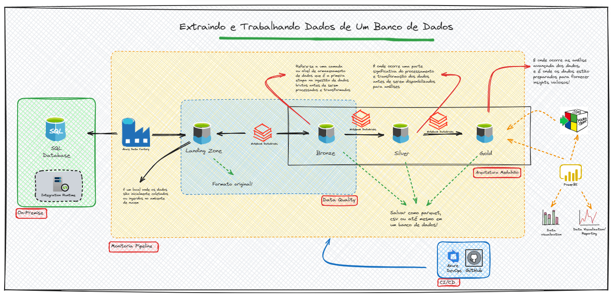

# Workshop BI com Azure e seus componentes

### Apresentação

Este Workshop tem como objetivo explorar todas as etapas do fluxo de dados de uma empresa, desde a sua origem até o destino final, utilizando uma esteira de dados no Azure de maneira abrangente e integrada.

Bem, amigo, caso tenha gostado da proposta, basta preencher o formulário abaixo para confirmar sua inscrição.

O investimento será de R$ 250,00, podendo ser pago via PIX ou Cartão de Crédito.

As aulas serão gravadas e estarão disponíveis no YouTube de forma privada!

Todo material do curso ficará disponível no GitHub -> [Material do Workshop](https://github.com/dbaassists/Projeto_do_Azure_ate_Data_Factory)

E a documentação do projeto que será abordado no Workshop você encontra aqui -> [Documentação Projeto](https://dbaassists.github.io/Projeto_do_Azure_ate_Data_Factory/)

O formulário de inscrição você encontra em -> [Formulário de Inscrição](https://forms.wix.com/f/7168778969481741171)

No workshop, abordaremos os seguintes assuntos:

1 - Falar sobre a importância dos dados nos dias de hoje;  
2 - Conhecer o ecossistema de cloud da Microsoft, o Azure;  
3 - Abordar conceitos de modelagem dimensional e arquitetura de dados;  
4 - Conhecer e explorar o que é ETL e ELT;  
5 - Falar sobre Data Warehouse, Data Lake, Delta Table e Data Lakehouse;  
6 - Criar uma conta no Azure;  
7 - Provisionar recursos (Resource Group, Azure Storage Account, Azure Data Factory, Azure Key Vault, Azure SQL Database, Azure Databricks);  
8 - Conhecer e configurar os tipos de Integration Runtime (IR) e saber como e quando devemos usá-los;  
9 - Aprender a trabalhar com recursos externos do Azure, Azure Storage Explorer e Azure Data Studio;  
10 - Trabalhar com CI/CD, com Azure DevOps e GitHub. Entender como essas soluções podem auxiliar em um ambiente corporativo;  
11 - Explorar o Azure Data Factory, criar Linked Services, DataSets, Pipelines;  
12 - Desbravar o Azure Databricks;  
13 - Aplicar Data Quality em um projeto de dados, podendo assim conhecer de perto seus benefícios e como ele pode ajudar no dia a dia das empresas;  
14 - Trabalhar com o Azure Key Vault para garantir conceitos de segurança;  
15 - Explorar um projeto de ponta a ponta.  
16 - Além de tudo isso, estarei trazendo experiências de projeto anteriores, abordando principalmente falhas que cometi para que você não faça o mesmo.  

Aproveito para deixar meus contatos.

E-mail: dbaassists@gmail.com  
[Intagram](https://www.instagram.com/dbaassists/) - https://www.instagram.com/dbaassists/  
[Twitter](https://twitter.com/dbaassists) - https://twitter.com/dbaassists  
[YouTube](https://www.youtube.com/@quintellao/featured) - https://www.youtube.com/@quintellao/featured  
[Blog DbaAssists](https://www.dbaassists.com.br/) - https://www.dbaassists.com.br/  
[GitHub](https://github.com/dbaassists) - https://github.com/dbaassists  
