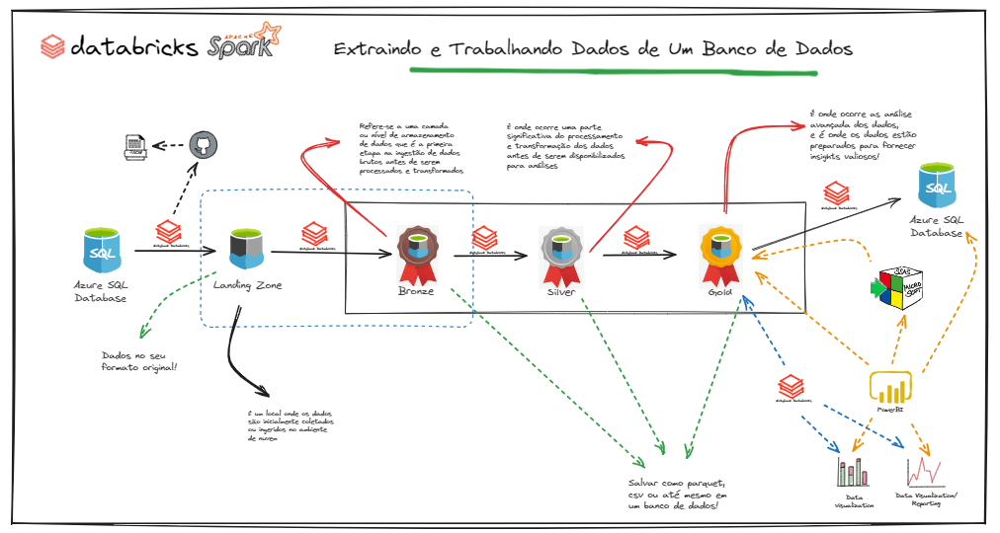

# Projeto_do_Azure_ate_Data_Factory

Este projeto tem como objetivo explorar todas as etapas do fluxo de dados de uma empresa, desde a sua origem até o destino final, utilizando uma esteira de dados no Azure de maneira abrangente e integrada.

Observou? Analisou? Entendeu?

Vou contar então o que o cliente pediu no ato da assinatura do contrato.

1 - Os dados da minha empresa estão disponíveis em um banco de dados;
Ponto que precisa ser esclarecido:

** Esse banco é OnPremise ou em alguma cloud?

O segundo ponto que ele destacou:

2 - Esses dados deverão ser extraídos do sistema de forma diária no formato delta e armazenados em algum lugar. Dados mestre extrai tudo e dados transacionais no formato delta;
Hunnnnn, eu pensei em persistir após a extração em uma camada Landing para posterior processamento, o que acha?

Como o volume de dados da empresa é alto, pensei em usar o databricks para processar utilizando a arquitetura medalhão!

Com isso pensei assim no fluxo:

4 - Após a extração, os dados são processados e armazenados na camada bronze sem nenhum tratamento de dados. A estrutura das tabelas da camada bronze deverão ser identicas a dos arquivos;

5 - Na camada silver, os dados deverão passar por transformações/tratamentos que são descritos mais a frente;

6 - Na camada gold, os dados devem estar modelados no padrão multidimensional, criando tabelas de dimensões e fato;

Pensando agora no modus operandi da nossa equipe estaremos usando uma esteira para controlar todos os desenvolvimentos e subidas para produção.

7 - Vamos abordar uso o GitHub e do Azure DevOps;
Precisamos pensar também na melhor forma para armazenar as credenciais de acesso aos recursos.

8 - Para esse ponto pensei em trabalhar com o Azure Key Vault;
E por último, precisamos ter um processo monitoramento e garantir a qualidade dos dados.

9 - Vamos usar técnicas de Data Quality e criar monitoramentos para nossas pipelines.
Como vamos fazer isso tudo acontecer?

Vem com a gente!

Gabriel Quintella